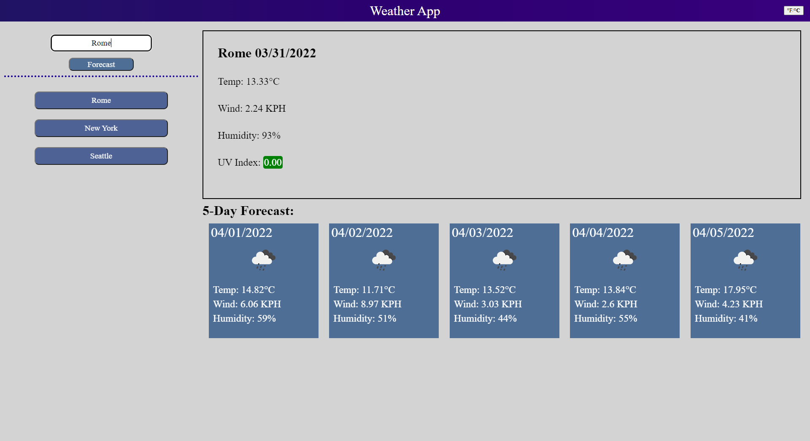

# Weather Forecast App

## Application

This page displays the weather forecast over the next 5 days of a chosen city. To get the weather data, it uses the Open Call API by OpenWeather to retrieve weather data given a latitude and longitute. It uses another API from OpenWeather called Geocoding to get a city's lat/lon given it's name. That response is then passed to the Open Call API to get request the city's weather data. All weather data is display in the city's local time, making time zones easy to handle.
This website also uses `localStorage` to remember the recent searches the user has made, up to 10 searches ago. It also stores information about the user's preferred units of measurement for when they return.

## APIs

The APIs used in the development of this app were [Moment](https://momentjs.com/) for converting Unix time to a date, [OpenWeather's Geocoding API](https://openweathermap.org/api/geocoding-api) to get a city's coordinates, and [OpenWeather's One Call API](https://openweathermap.org/api/one-call-api) to get a location's weather data.

## Purpose

I developed this app as a homework assignment for a coding bootcamp I'm attending through the University of Washington. The assignment was meant to focus on fetching data over the internet and using asynchronous JavaScript.

### Example

## Live Link

- - -
[Deployed page](https://phoenix-staley.github.io/weatherApp/)